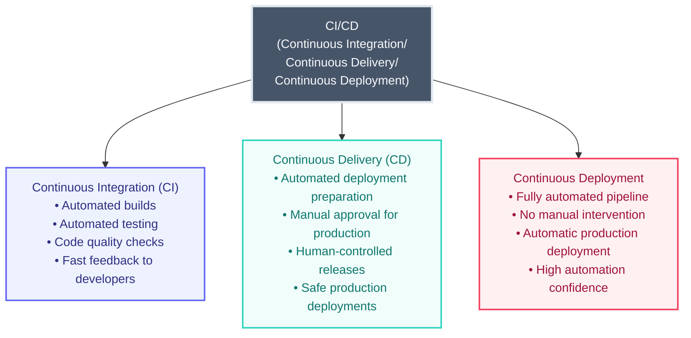
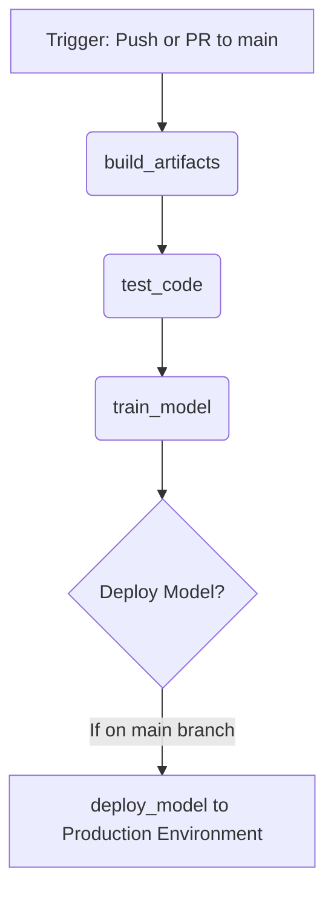
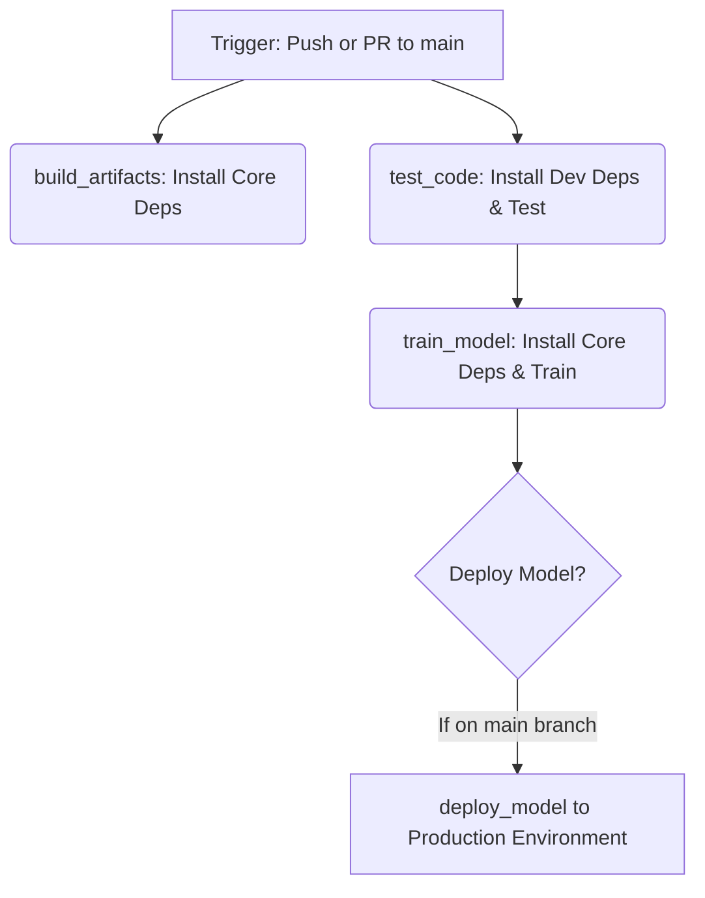
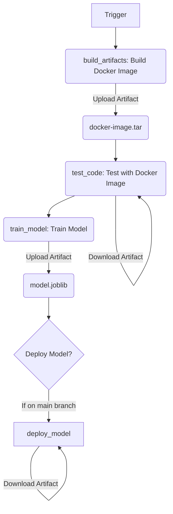
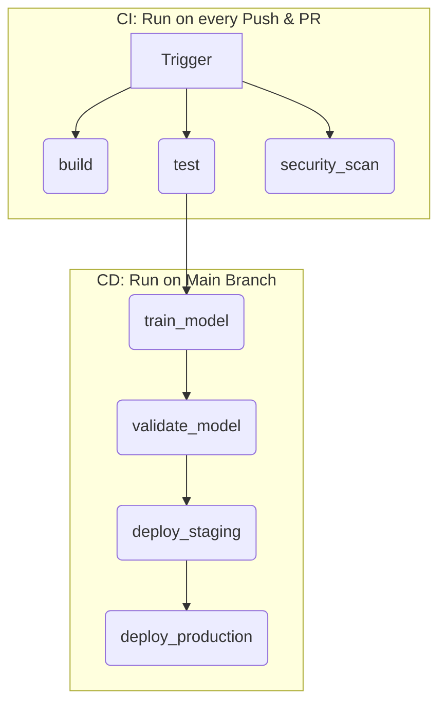

# MLOps for Modern AI: Mastering CI/CD with GitHub Actions



## 1. CI/CD in Machine Learning and the Role of MLOps

### What is CI/CD?

**CI/CD** stands for **Continuous Integration** and **Continuous Delivery/Deployment**. It's a set of practices that automates the software release lifecycle, from code changes to deployment.

- **Continuous Integration (CI):** Developers frequently merge their code into a central repository. After each merge, an automated process builds the software and runs tests to detect integration issues early.
- **Continuous Delivery (CD):** This practice extends CI by automatically preparing every code change for a release to a production environment. It ensures that you can deploy your application reliably at any time.
- **Continuous Deployment (CD):** This is the next step after Continuous Delivery. Every change that passes all stages of the pipeline is automatically deployed to production, with no human intervention.

### Why ML/AI Projects are Different

While CI/CD is a cornerstone of modern software development, Machine Learning (ML) projects introduce unique challenges that traditional CI/CD pipelines don't fully address:

- **Data is a First-Class Citizen:** Models are as dependent on data as they are on code. Changes in the training data (new data, different preprocessing) must be versioned and tracked.
- **Experimentation is Key:** ML is highly iterative. Data scientists run hundreds of experiments with different models, parameters, and datasets. Tracking these experiments is crucial for reproducibility.
- **Model Versioning:** The output of the "build" process is not just an application, but a trained model. This model, along with its metrics and parameters, needs to be versioned.
- **Performance Degradation (Drift):** Models can become less accurate over time as the real-world data they see in production "drifts" away from the data they were trained on. This necessitates monitoring and periodic retraining.
- **Complex Testing:** Testing an ML model involves more than just unit tests. It requires data validation, model performance evaluation against specific metrics (like accuracy or F1-score), and checking for fairness or bias.

### The Role of MLOps

**MLOps (Machine Learning Operations)** is a set of practices that combines ML, DevOps, and Data Engineering to deploy and maintain ML systems in production reliably and efficiently. It extends the principles of DevOps to the entire ML lifecycle.

**CI/CD is the engine that powers MLOps.** A well-structured CI/CD pipeline in an MLOps context automates:

- **Data Validation:** Automatically checking new data for quality and schema consistency.
- **Model Training:** Triggering model retraining whenever new code or data is available.
- **Model Evaluation:** Rigorously testing model performance against established benchmarks or "quality gates."
- **Model Deployment:** Safely deploying validated models to staging or production environments.
- **Reproducibility:** Ensuring that every trained model can be traced back to the exact code, data, and configuration used to create it.

By automating these steps, MLOps allows teams to deliver high-quality ML models faster and more reliably.

## 2. GitHub Actions Fundamentals for MLOps

**GitHub Actions** is a CI/CD platform built directly into GitHub, allowing you to automate workflows in response to events in your repository. Workflows are defined in YAML files located in the `.github/workflows/` directory.

### Anatomy of a GitHub Actions Workflow File

Let's break down the core components of a workflow file:

- **`name`**: The name of your workflow, which appears in the "Actions" tab of your GitHub repository.
- **`on`**: Defines the events that trigger the workflow. Common triggers for MLOps include:
  - `push`: When code is pushed to a specific branch (e.g., `main`).
  - `pull_request`: When a pull request is opened against a branch.
  - `workflow_dispatch`: Allows for manual triggering from the GitHub UI.
  - `release`: When a new release is published.
- **`jobs`**: A workflow is composed of one or more jobs. By default, jobs run in parallel. For MLOps, you'll often define a sequence of jobs.
  - **`job_id`**: A unique identifier for the job (e.g., `build`, `test`, `train-model`).
  - **`runs-on`**: The type of virtual machine the job will execute on (e.g., `ubuntu-latest`).
  - **`needs`**: This is crucial for creating sequential pipelines. A job with `needs` will wait for the specified job(s) to complete successfully before it starts.
  - **`if`**: A conditional statement that determines whether a job should run. For example, `if: github.ref == 'refs/heads/main'` ensures a job only runs on the `main` branch.
  - **`environment`**: Links a job to a GitHub Environment. Environments allow you to set up protection rules (like required approvals for production) and manage environment-specific secrets.
  - **`steps`**: A list of individual tasks to be executed sequentially within a job.
    - **`name`**: A descriptive name for the step.
    - **`uses`**: Specifies a reusable "action" from the GitHub Marketplace (e.g., `actions/checkout@v4` to check out code).
    - **`run`**: Executes one or more shell commands.
    - **`with`**: Provides input parameters to an action.

By combining these components, you can define a complete MLOps pipeline, where each `job` represents a distinct stage like building, testing, training, or deploying your model.

---

## 3. GitHub Actions Examples for MLOps

Let's walk through the examples, from a simple foundation to a production-ready MLOps pipeline.

### Example 1: The Foundational Pipeline (`github-ci.yml`)

This workflow introduces the most fundamental concept: creating a sequence of jobs that represent the stages of a pipeline.

```yaml
# Simple GitHub Actions workflow - equivalent to .gitlab-ci.yml simplicity
# This is the simplest possible version for learning

name: github-ci

on:
  push:
    branches: [ main ]
  pull_request:
    branches: [ main ]

jobs:
  build_artifacts:
    runs-on: ubuntu-latest
    steps:
      - uses: actions/checkout@v4
      - run: echo "This job builds something (Docker, packages...)"

  test_code:
    runs-on: ubuntu-latest
    needs: build_artifacts
    steps:
      - uses: actions/checkout@v4
      - run: |
          echo "This job tests something built by the build_artifacts job"
          echo "Test job is complete"

  train_model:
    runs-on: ubuntu-latest
    needs: test_code
    steps:
      - uses: actions/checkout@v4
      - run: |
          echo "This job trains a new model"
          echo "Model train is complete"

  deploy_model:
    runs-on: ubuntu-latest
    needs: train_model
    if: github.ref == 'refs/heads/main'
    environment: production
    steps:
      - uses: actions/checkout@v4
      - run: |
          echo "This job deploys a model"
          echo "Model deploy is complete"
```

**Explanation:**

- **Sequential Execution with `needs`:** The `needs` keyword is the key here. It establishes a dependency chain: `build_artifacts` → `test_code` → `train_model` → `deploy_model`. Each job only starts after the previous one has succeeded.
- **Conditional Deployment:** The `deploy_model` job includes two important conditions:
    1. `if: github.ref == 'refs/heads/main'`: This ensures deployment only happens when changes are merged into the `main` branch, preventing deployments from pull requests.
    2. `environment: production`: This links the job to a GitHub Environment named "production". You can configure this environment in your repository settings to require manual approval before the job can run, providing a crucial safety check for production deployments.

**MLOps Context:**
This simple structure perfectly maps to a basic MLOps workflow. It automates the entire process from building the environment to deploying the model, ensuring each step is completed successfully before the next one begins.

**Mermaid Diagram:**



---

### Example 2: A Practical Python ML Pipeline (`1-get-started.yml`)

This workflow builds on the basic structure by adding realistic steps for a Python project, including environment setup and modern dependency management.

**Mermaid Diagram:**



**Explanation:**

- **`env` Block:** Defines a `PYTHON_VERSION` variable that can be reused across all jobs, ensuring consistency.
- **`actions/setup-python@v4`:** A standard action to install a specific version of Python on the runner.
- **`astral-sh/setup-uv@v3`:** Installs `uv`, an extremely fast Python package manager that is a modern replacement for `pip`.
- **Dependency Management:**
  - `uv pip install --system --requirement pyproject.toml`: Installs the project's core dependencies from `pyproject.toml`.
  - `--extra dev`: In the `test_code` job, this command installs additional development dependencies (like `pytest`) which are defined in an `optional-dependencies` section in `pyproject.toml`. This keeps the production environment lean while providing necessary tools for testing.

**MLOps Context:**
This workflow demonstrates how to create a reproducible environment for each stage of the MLOps pipeline. By installing dependencies from a locked file (`pyproject.toml`), you ensure that the testing environment is identical to the training environment, which is crucial for reliable results.

---

### Example 3: Using Docker and Artifacts (`2-understanding-cicd.yml`)

This workflow introduces two critical MLOps concepts: containerization with Docker and passing files (artifacts) between jobs.

**Mermaid Diagram:**



**Explanation:**

- **Dockerization:** The `build_artifacts` job simulates building a Docker image. In a real-world scenario, this would involve a `Dockerfile` to create a reproducible environment for your ML application. The image is saved as a `.tar` file.
- **`actions/upload-artifact@v4`:** This action is used to upload files from a job's workspace. Here, it uploads the saved Docker image (`docker-image.tar`) and the trained model (`model.joblib`).
- **`actions/download-artifact@v4`:** This action downloads artifacts that were uploaded in previous jobs of the same workflow run. The `test_code` job downloads the Docker image, and the `deploy_model` job downloads the trained model.

**MLOps Context:**
This is a huge step towards reproducibility.

1. **Containerizing the environment** ensures that the model runs in the exact same software environment everywhere.
2. **Passing artifacts** is the key to ensuring that the *exact* model trained in the `train_model` job is the one that gets deployed in the `deploy_model` job. This avoids accidentally deploying a different or older version.

---

### Example 4: Production-Ready MLOps Pipeline (`3-best-practices-github.yml`)

This workflow is a comprehensive, production-grade MLOps pipeline that incorporates security, caching, advanced Docker practices, quality gates, and staged deployments.

**Mermaid Diagram:**



**Explanation of Best Practices:**

- **Advanced Docker Workflow:** Instead of passing a `.tar` file, this workflow builds and pushes the Docker image directly to a container registry (`ghcr.io`). The `docker/metadata-action` automatically generates meaningful tags (e.g., branch name, git SHA), which is crucial for traceability.
- **Caching (`actions/cache@v3`):** The `test` job caches Python dependencies. This dramatically speeds up subsequent workflow runs by avoiding the need to download and install packages from scratch every time.
- **Parallel Jobs:** The `build`, `test`, and `security_scan` jobs can run in parallel, providing faster feedback to the developer.
- **Security Scanning:** A dedicated `security_scan` job runs tools like `safety` (for dependency vulnerabilities) and `bandit` (for static code analysis). `continue-on-error: true` ensures that the pipeline doesn't stop if vulnerabilities are found, but the reports are still generated and can be reviewed.
- **Model Quality Gates (`validate_model` job):** This is a critical MLOps concept. After training, a dedicated job downloads the model and its metrics, and runs a script to check if they meet a predefined quality threshold (e.g., "is accuracy > 80%?"). If the model doesn't pass, the job fails (`exit(1)`), preventing a low-quality model from being deployed.
- **Staged Deployments:** The workflow deploys first to a `staging` environment and only then to `production`. This allows for final testing in a production-like environment before impacting real users.

**MLOps Context:**
This workflow represents a mature MLOps pipeline. It automates not just the "happy path" but also incorporates essential checks for security, quality, and reliability. It provides fast feedback through parallel jobs and caching, while ensuring safe deployments through quality gates and staged rollouts with manual approvals.

## Conclusion

GitHub Actions provides all the necessary tools to build sophisticated, automated MLOps pipelines. By starting with a simple sequential workflow and gradually incorporating concepts like Docker, artifacts, caching, security scanning, and quality gates, you can create a robust CI/CD system that accelerates your ML development lifecycle while ensuring the reliability and quality of your models in production.
